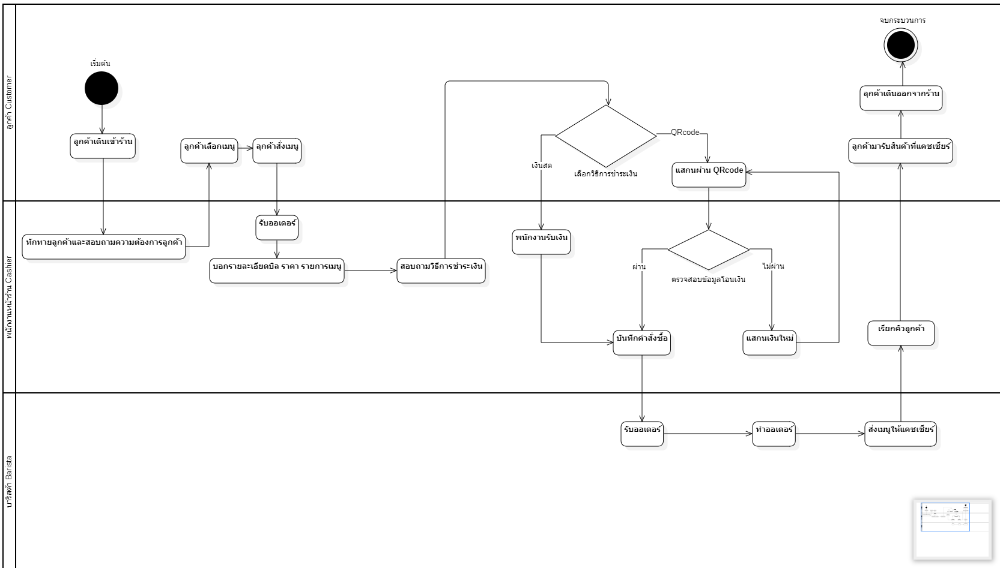
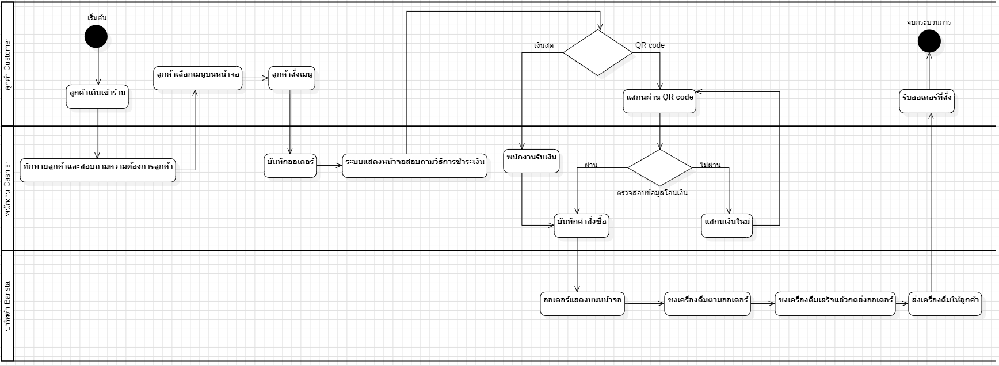

# รายงานความเป็นไปได้ (Feasibility Report)

## โครงการ: ระบบ POS สำหรับร้านกาแฟเครือข่าย 4 สาขา

| หัวข้อ                  | เนื้อหา                                                                                  | ตัวอย่างเนื้อหา (ระบบร้านกาแฟ)                                                                                                                                                 |
| ----------------------- | ---------------------------------------------------------------------------------------- | ------------------------------------------------------------------------------------------------------------------------------------------------------------------------------ |
| ภาพรวมโครงการ           | ชื่อระบบ วัตถุประสงค์ ขอบเขตโดยสรุป ผู้มีส่วนได้ส่วนเสียหลัก                             | ระบบ POS และจัดการสต็อกสำหรับร้านกาแฟ 4 สาขา เพื่อเชื่อมโยงการขายและตัดสต็อกอัตโนมัติ พร้อมแสดงยอดขายรวมแบบเรียลไทม์ ผู้ใช้หลักคือเจ้าของร้าน ผู้จัดการสาขา และพนักงานหน้าร้าน |
| Technical Feasibility   | เทคโนโลยีที่ใช้ ความพร้อมของทีม ความเสี่ยงด้านเทคนิค                                     | ใช้ React, Node.js/Express และ MySQL ทีมมีประสบการณ์ระดับปานกลาง ความเสี่ยงคือการซิงค์ข้อมูลระหว่างสาขาและการเชื่อมต่อเครื่องพิมพ์ใบเสร็จ                                      |
| Economic Feasibility    | ต้นทุนโดยประมาณ (one-time/recurring) ผลประโยชน์ที่คาดว่าจะได้รับ ระยะเวลาคืนทุนโดยประมาณ | ต้นทุนพัฒนาและอุปกรณ์ 120,000 บาท ค่าใช้จ่ายรายเดือน 3,000 บาท ประหยัดเวลา ลดข้อผิดพลาดของสต็อก และคาดว่าคืนทุนภายใน 8–10 เดือน                                                |
| Operational Feasibility | ผลกระทบต่อผู้ใช้งาน ความพร้อมขององค์กร แผนฝึกอบรม                                        | พนักงานต้องฝึกใช้ระบบ POS ใหม่ 2 ชั่วโมงต่อสาขา รวมประมาณ 16-20 คนทั้งเครือข่าย เจ้าของร้านสนับสนุนเต็มที่ มีอินเทอร์เน็ตพร้อมใช้งาน และมีแผนทดลองใช้ก่อนเปลี่ยนระบบจริง       |
| Schedule Feasibility    | แผนเวลาโดยสรุป (timeline) พร้อม milestone หลัก                                           | สัปดาห์ 1–3 วิเคราะห์/ออกแบบ, 4–10 พัฒนา, 11–12 ทดสอบระบบ, 13–15 ทดลองใช้และขยายทุกสาขา, 16 สรุปและนำเสนอผลโครงการ                                                             |
| ข้อสรุป                 | ควรดำเนินโครงการต่อหรือไม่ พร้อมเหตุผลสรุปจากทั้ง 4 มิติ                                 | ควรดำเนินโครงการต่อ เนื่องจากคุ้มค่าต่อการลงทุน ทีมมีความพร้อมด้านเทคนิค องค์กรสนับสนุน และมีระยะเวลาดำเนินงานเหมาะสม                                                          |

# ภาพBPMN

## แบบ As-Is

## แบบ To-Be

