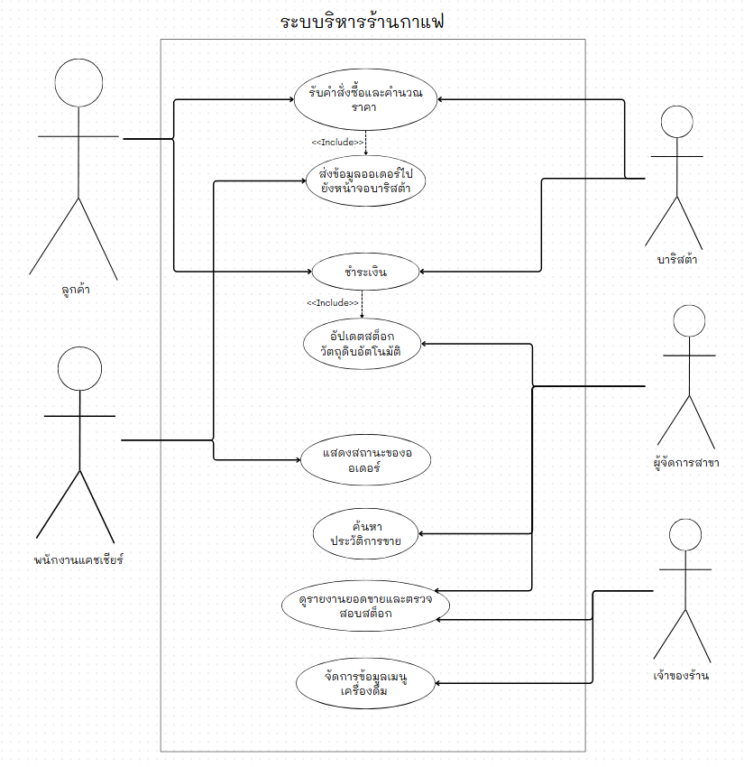

# WK04: User Stories และ Use Case Diagram

## ระบบบริหารร้านกาแฟ (Coffee Shop POS & Inventory System)

---

# 1. Actor ที่เกี่ยวข้องกับระบบ

จาก Stakeholders และ Functional Requirements ที่ระบุไว้ใน WK03 สามารถกำหนด Actor ที่เกี่ยวข้องกับระบบได้ 5 Actor ดังนี้

| Actor | บทบาท / เหตุผลที่เกี่ยวข้อง | อ้างอิงจาก WK03 |
|---|---|---|
| **เจ้าของร้านกาแฟ** | ตรวจสอบรายงานยอดขายและสต็อกของทุกสาขา และจัดการข้อมูลเมนูเครื่องดื่ม | Stakeholder, FR-08, FR-09, FR-10 |
| **ผู้จัดการสาขา** | ตรวจสอบข้อมูลการขายและสต็อกของสาขาที่รับผิดชอบ | Stakeholder, FR-07, FR-08, FR-09 |
| **พนักงานแคชเชียร์** | รับคำสั่งซื้อผ่านระบบ POS คำนวณราคา และดำเนินการชำระเงิน | Stakeholder, FR-01, FR-02, FR-03 |
| **บาริสต้า** | รับข้อมูลออเดอร์และจัดการสถานะของออเดอร์ | Stakeholder, FR-04, FR-06 |
| **ลูกค้า** | สั่งสินค้าและเลือกวิธีการชำระเงิน | Stakeholder, FR-01, FR-03 |

---

# 2. Use Case Diagram

## 2.1 รายการ Use Case

จาก Functional Requirements ใน WK03 สามารถกำหนด Use Case หลักของระบบได้ 8 Use Cases ดังนี้

| รหัส | ชื่อ Use Case | Actor หลัก | FR ที่เกี่ยวข้อง |
|---|---|---|---|
| **UC-01** | รับคำสั่งซื้อและคำนวณราคา | พนักงานแคชเชียร์ | FR-01, FR-02 |
| **UC-02** | ชำระเงิน | พนักงานแคชเชียร์, ลูกค้า | FR-03 |
| **UC-03** | ส่งข้อมูลออเดอร์ไปยังหน้าจอบาริสต้า | บาริสต้า | FR-04 |
| **UC-04** | อัปเดตสต็อกวัตถุดิบอัตโนมัติ | ผู้จัดการสาขา | FR-05 |
| **UC-05** | แสดงสถานะของออเดอร์ | บาริสต้า | FR-06 |
| **UC-06** | ค้นหาประวัติการขาย | ผู้จัดการสาขา | FR-07 |
| **UC-07** | ดูรายงานยอดขายและตรวจสอบสต็อก | เจ้าของร้าน, ผู้จัดการสาขา | FR-08, FR-09 |
| **UC-08** | จัดการข้อมูลเมนูเครื่องดื่ม | เจ้าของร้าน | FR-10 |

---

## 2.2 ความสัมพันธ์ระหว่าง Use Case

### Include

**UC-01 "รับคำสั่งซื้อและคำนวณราคา" → UC-03 "ส่งข้อมูลออเดอร์ไปยังหน้าจอบาริสต้า"**

หลังจากมีการรับคำสั่งซื้อและคำนวณราคาแล้ว ระบบต้องส่งข้อมูลออเดอร์ไปยังหน้าจอบาริสต้าตาม FR-04

จึงสามารถแสดงความสัมพันธ์แบบ `<<include>>` ได้

---

**UC-02 "ชำระเงิน" → UC-04 "อัปเดตสต็อกวัตถุดิบอัตโนมัติ"**

เมื่อมีการขายสินค้า ระบบต้องอัปเดตจำนวนวัตถุดิบในสต็อกโดยอัตโนมัติตาม FR-05

จึงสามารถแสดงความสัมพันธ์แบบ `<<include>>` ได้

---

### Extend

จากข้อมูลใน WK03 **ยังไม่มี Functional Requirement ที่ระบุพฤติกรรมทางเลือกซึ่งจำเป็นต้องใช้ `<<extend>>` โดยตรง**

ดังนั้นใน Use Case Diagram นี้ **ไม่จำเป็นต้องฝืนเพิ่ม Extend** เพียงเพื่อให้มีความสัมพันธ์แบบ Extend

ส่วนการชำระเงินด้วย QR Payment เป็นส่วนหนึ่งของ FR-03 ซึ่งระบุว่า:

> ระบบต้องรองรับการชำระเงินด้วยเงินสดและ QR Payment

จึงสามารถถือเป็น **ตัวเลือกภายใน Use Case "ชำระเงิน"** ได้ โดยไม่จำเป็นต้องสร้าง Extend เพิ่มจากข้อมูล WK03

---

## 2.3 แผนภาพ

### โครงสร้าง Use Case Diagram ที่ควรวาด





---

# 3. Use Case Description: UC-01 "รับคำสั่งซื้อและคำนวณราคา"

```text
Use Case: รับคำสั่งซื้อและคำนวณราคา

Actor:
  - พนักงานแคชเชียร์ (Primary Actor)
  - ลูกค้า (Secondary Actor)

Precondition:
  - ระบบมีข้อมูลเมนูเครื่องดื่ม
  - ระบบมีข้อมูลราคาของเมนู

Main Flow:
1. ลูกค้าแจ้งรายการสินค้าที่ต้องการ
2. พนักงานแคชเชียร์บันทึกรายการสั่งซื้อผ่านระบบ POS
3. ระบบแสดงรายการสินค้าที่เลือก
4. ระบบคำนวณราคารวมโดยอัตโนมัติ
5. ระบบแสดงยอดที่ต้องชำระ
6. พนักงานแคชเชียร์ตรวจสอบรายการสั่งซื้อ
7. พนักงานแคชเชียร์ยืนยันคำสั่งซื้อ
8. ระบบบันทึกคำสั่งซื้อ
9. ระบบส่งข้อมูลออเดอร์ไปยังหน้าจอบาริสต้า

Alternative Flow:
2a. ลูกค้าต้องการเปลี่ยนรายการสินค้า
    - พนักงานแคชเชียร์แก้ไขรายการสินค้า
    - ระบบคำนวณราคารวมใหม่
    - กลับไปยังขั้นตอนที่ 6

2b. ลูกค้าต้องการเปลี่ยนจำนวนสินค้า
    - พนักงานแคชเชียร์แก้ไขจำนวน
    - ระบบคำนวณราคารวมใหม่
    - กลับไปยังขั้นตอนที่ 6

Exception Flow:
2c. ไม่พบเมนูที่ลูกค้าต้องการในระบบ
    - ระบบแจ้งว่าไม่มีข้อมูลเมนูดังกล่าว
    - พนักงานแคชเชียร์แจ้งลูกค้า
    - ไม่สามารถเพิ่มรายการดังกล่าวได้

Postcondition:
  - คำสั่งซื้อถูกบันทึกในระบบ
  - ระบบมีข้อมูลรายการสั่งซื้อ
  - ข้อมูลออเดอร์ถูกส่งไปยังหน้าจอบาริสต้า
```

---

# 4. User Stories และ Acceptance Criteria

## ตารางแปลง Functional Requirement → User Story

| FR จาก WK03 | User Story |
|---|---|
| FR-01, FR-02 | **US-01** |
| FR-03 | **US-02** |
| FR-04, FR-06 | **US-03** |
| FR-05 | **US-04** |
| FR-07 | **US-05** |
| FR-08, FR-09 | **US-06** |
| FR-10 | **US-07** |

---

## US-01: รับคำสั่งซื้อและคำนวณราคา

> **As a** พนักงานแคชเชียร์,  
> **I want** บันทึกคำสั่งซื้อผ่านระบบ POS และให้ระบบคำนวณราคารวมโดยอัตโนมัติ,  
> **So that** ลดเวลาในการรับออเดอร์และลดข้อผิดพลาดในการคำนวณราคา

### Acceptance Criteria

- Given ลูกค้าแจ้งรายการสินค้าที่ต้องการ, When พนักงานแคชเชียร์บันทึกรายการผ่านระบบ POS, Then ระบบต้องบันทึกคำสั่งซื้อได้
- Given มีรายการสินค้าในคำสั่งซื้อ, When ระบบคำนวณราคา, Then ระบบต้องแสดงราคารวมของคำสั่งซื้อ
- Given มีการเปลี่ยนรายการหรือจำนวนสินค้า, When พนักงานแคชเชียร์แก้ไขข้อมูล, Then ระบบต้องคำนวณราคารวมใหม่

---

## US-02: ชำระเงิน

> **As a** ลูกค้า,  
> **I want** สามารถชำระเงินด้วยเงินสดหรือ QR Payment,  
> **So that** สามารถเลือกวิธีชำระเงินที่ต้องการได้

### Acceptance Criteria

- Given มีคำสั่งซื้อที่ต้องชำระเงิน, When ลูกค้าเลือกชำระด้วยเงินสด, Then ระบบต้องรองรับการชำระเงินด้วยเงินสด
- Given มีคำสั่งซื้อที่ต้องชำระเงิน, When ลูกค้าเลือก QR Payment, Then ระบบต้องรองรับการชำระเงินด้วย QR Payment
- Given ลูกค้าเลือกวิธีชำระเงิน, When การชำระเงินเสร็จสิ้น, Then ระบบต้องบันทึกข้อมูลการชำระเงินของคำสั่งซื้อ

---

## US-03: ส่งออเดอร์และแสดงสถานะออเดอร์

> **As a** บาริสต้า,  
> **I want** รับข้อมูลออเดอร์และสามารถจัดการสถานะของออเดอร์,  
> **So that** สามารถดำเนินการตามรายการสั่งซื้อและทราบสถานะของออเดอร์ได้

### Acceptance Criteria

- Given มีการบันทึกคำสั่งซื้อในระบบ, When ระบบส่งข้อมูลออเดอร์, Then ข้อมูลต้องถูกส่งไปยังหน้าจอบาริสต้า
- Given มีออเดอร์ที่อยู่ระหว่างการดำเนินงาน, When บาริสต้าอัปเดตสถานะ, Then ระบบต้องแสดงสถานะของออเดอร์ที่ถูกอัปเดต
- Given ออเดอร์มีสถานะการทำงาน, When ผู้ใช้งานตรวจสอบออเดอร์, Then ระบบต้องสามารถแสดงสถานะ เช่น "กำลังทำ", "เสร็จแล้ว" และ "รับสินค้าแล้ว"

---

## US-04: อัปเดตสต็อกวัตถุดิบอัตโนมัติ

> **As a** ผู้จัดการสาขา,  
> **I want** ให้ระบบอัปเดตจำนวนวัตถุดิบในสต็อกโดยอัตโนมัติเมื่อมีการขายสินค้า,  
> **So that** สามารถตรวจสอบจำนวนวัตถุดิบในสต็อกได้อย่างสะดวก

### Acceptance Criteria

- Given มีการขายสินค้า, When ระบบบันทึกการขาย, Then ระบบต้องอัปเดตจำนวนวัตถุดิบในสต็อกโดยอัตโนมัติ
- Given มีการขายสินค้าหลายรายการ, When ระบบอัปเดตสต็อก, Then จำนวนวัตถุดิบต้องถูกปรับตามสินค้าที่ขาย
- Given ไม่มีการขายสินค้า, When ระบบตรวจสอบสต็อก, Then ระบบต้องไม่ลดจำนวนวัตถุดิบจากการขาย

---

## US-05: ค้นหาประวัติการขาย

> **As a** ผู้จัดการสาขา,  
> **I want** ค้นหาประวัติการขายย้อนหลังตามวันที่,  
> **So that** สามารถตรวจสอบข้อมูลการขายของร้านได้

### Acceptance Criteria

- Given ระบบมีประวัติการขาย, When ผู้จัดการสาขาเลือกวันที่, Then ระบบต้องแสดงประวัติการขายของวันที่เลือก
- Given วันที่เลือกมีข้อมูลการขาย, When ระบบค้นหาข้อมูล, Then ระบบต้องแสดงรายการขายของวันนั้น
- Given วันที่เลือกไม่มีข้อมูลการขาย, When ระบบค้นหาข้อมูล, Then ระบบต้องแสดงว่าไม่มีข้อมูลการขายของวันที่เลือก

---

## US-06: ดูรายงานยอดขายและตรวจสอบสต็อก

> **As a** เจ้าของร้าน,  
> **I want** ตรวจสอบยอดขายและสต็อกของทุกสาขา,  
> **So that** สามารถติดตามผลการดำเนินงานของแต่ละสาขาได้

### Acceptance Criteria

- Given ร้านมีหลายสาขา, When เจ้าของร้านเปิดรายงานยอดขาย, Then ระบบต้องแสดงยอดขายแยกตามแต่ละสาขา
- Given แต่ละสาขามีข้อมูลสต็อก, When เจ้าของร้านตรวจสอบสต็อก, Then ระบบต้องแสดงข้อมูลสต็อกของแต่ละสาขา
- Given เจ้าของร้านต้องการดูข้อมูลของแต่ละสาขา, When เลือกสาขา, Then ระบบต้องแสดงข้อมูลของสาขาที่เลือก

---

## US-07: จัดการข้อมูลเมนูเครื่องดื่ม

> **As a** เจ้าของร้าน,  
> **I want** เพิ่ม แก้ไข และลบข้อมูลเมนูเครื่องดื่ม,  
> **So that** สามารถจัดการข้อมูลเมนูของร้านให้เป็นปัจจุบันได้

### Acceptance Criteria

- Given เจ้าของร้านต้องการเพิ่มเมนู, When กรอกข้อมูลเมนูและบันทึก, Then ระบบต้องสามารถเพิ่มข้อมูลเมนูได้
- Given มีข้อมูลเมนูอยู่ในระบบ, When เจ้าของร้านแก้ไขข้อมูล, Then ระบบต้องบันทึกข้อมูลที่แก้ไข
- Given มีเมนูที่ไม่ต้องการใช้งาน, When เจ้าของร้านเลือกเมนูและลบ, Then ระบบต้องลบข้อมูลเมนูดังกล่าว

---

# 5. ตรวจสอบ INVEST

| User Story | Independent | Negotiable | Valuable | Estimable | Small | Testable |
|---|---|---|---|---|---|---|
| **US-01** | สามารถพัฒนาแยกเป็นฟังก์ชันการรับออเดอร์ได้ | รูปแบบการแสดงผลสามารถปรับได้ | ช่วยลดเวลาและข้อผิดพลาดในการรับออเดอร์ | ขอบเขตคือรับออเดอร์และคำนวณราคา | จำกัดเฉพาะการรับออเดอร์และคำนวณราคา | ตรวจสอบรายการและราคารวมได้ |
| **US-02** | สามารถพัฒนาแยกเป็นฟังก์ชันการชำระเงินได้ | รูปแบบการชำระเงินสามารถปรับได้ตามระบบ | ช่วยให้ลูกค้าชำระเงินได้สะดวก | ขอบเขตคือเงินสดและ QR Payment | จำกัดเฉพาะการชำระเงิน | ทดสอบวิธีชำระเงินได้ |
| **US-03** | สามารถพัฒนาแยกจากการรับออเดอร์ได้ | รูปแบบการแสดงสถานะสามารถปรับได้ | ช่วยให้บาริสต้าทราบข้อมูลและสถานะออเดอร์ | ขอบเขตคือส่งข้อมูลและแสดงสถานะ | จำกัดเฉพาะการจัดการสถานะออเดอร์ | ตรวจสอบสถานะที่แสดงได้ |
| **US-04** | สามารถพัฒนาเป็นฟังก์ชันจัดการสต็อกได้ | วิธีการอัปเดตสามารถปรับได้ | ลดภาระการอัปเดตสต็อกด้วยตนเอง | ขอบเขตคืออัปเดตสต็อกเมื่อมีการขาย | จำกัดเฉพาะสต็อกวัตถุดิบ | ตรวจสอบจำนวนก่อนและหลังการขายได้ |
| **US-05** | สามารถพัฒนาแยกจากรายงานยอดขายได้ | รูปแบบการค้นหาสามารถปรับได้ | ช่วยตรวจสอบประวัติการขาย | ขอบเขตคือค้นหาตามวันที่ | จำกัดเฉพาะประวัติการขาย | ตรวจสอบข้อมูลตามวันที่ได้ |
| **US-06** | สามารถพัฒนาเป็นส่วนรายงานได้ | รูปแบบรายงานสามารถปรับได้ | ช่วยติดตามยอดขายและสต็อกของแต่ละสาขา | ขอบเขตคือยอดขายและสต็อก | จำกัดเฉพาะข้อมูลของแต่ละสาขา | ตรวจสอบข้อมูลยอดขายและสต็อกได้ |
| **US-07** | สามารถพัฒนาเป็นส่วนจัดการเมนูได้ | รูปแบบการจัดการเมนูสามารถปรับได้ | ช่วยให้ข้อมูลเมนูเป็นปัจจุบัน | ขอบเขตคือเพิ่ม แก้ไข และลบเมนู | จำกัดเฉพาะข้อมูลเมนู | ทดสอบการเพิ่ม แก้ไข และลบได้ |

---

# 6. Traceability: WK03 → WK04

เพื่อยืนยันว่า User Stories มาจาก Requirements ของ WK03 โดยตรง สามารถตรวจสอบได้ดังนี้

| WK03 Functional Requirement | WK04 Use Case | WK04 User Story |
|---|---|---|
| **FR-01** รับคำสั่งซื้อผ่าน POS | UC-01 | US-01 |
| **FR-02** คำนวณราคารวม ส่วนลด และยอดชำระ | UC-01 | US-01 |
| **FR-03** ชำระเงินสดและ QR Payment | UC-02 | US-02 |
| **FR-04** ส่งออเดอร์ไปยังหน้าจอบาริสต้า | UC-03 | US-03 |
| **FR-05** อัปเดตสต็อกอัตโนมัติ | UC-04 | US-04 |
| **FR-06** แสดงสถานะของออเดอร์ | UC-05 | US-03 |
| **FR-07** ค้นหาประวัติการขายตามวันที่ | UC-06 | US-05 |
| **FR-08** รายงานยอดขายแยกตามสาขา | UC-07 | US-06 |
| **FR-09** ตรวจสอบสต็อกของทุกสาขา | UC-07 | US-06 |
| **FR-10** เพิ่ม แก้ไข และลบข้อมูลเมนู | UC-08 | US-07 |

---

# 7. สรุป

จาก Requirements Document ใน WK03 สามารถนำ Functional Requirements ทั้ง 10 ข้อมาวิเคราะห์และแปลงเป็น Use Case และ User Story สำหรับ WK04 ได้

ระบบมี Actor ทั้งหมด 5 กลุ่ม ได้แก่ **เจ้าของร้านกาแฟ ผู้จัดการสาขา พนักงานแคชเชียร์ บาริสต้า และลูกค้า**

Use Case ของระบบครอบคลุมการรับคำสั่งซื้อ การคำนวณราคา การชำระเงิน การส่งออเดอร์ไปยังบาริสต้า การอัปเดตสต็อก การแสดงสถานะออเดอร์ การค้นหาประวัติการขาย การดูรายงานยอดขายและตรวจสอบสต็อก รวมถึงการจัดการข้อมูลเมนูเครื่องดื่ม

User Stories ทั้ง 7 รายการถูกสร้างขึ้นจาก Functional Requirements ใน WK03 โดยตรง และแต่ละ User Story มี Acceptance Criteria เพื่อใช้เป็นเกณฑ์ในการตรวจสอบการทำงานของระบบในขั้นตอนต่อไป

ทั้งนี้ ข้อมูลที่ใช้ในการกำหนดความต้องการของระบบในเอกสาร WK04 ฉบับนี้อ้างอิงจาก WK03 เท่านั้น โดยตัวอย่าง WK04 ที่ได้รับใช้เป็นเพียงแนวทางด้านรูปแบบและโครงสร้างของเอกสาร
