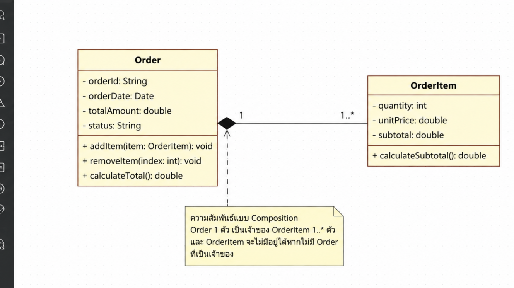
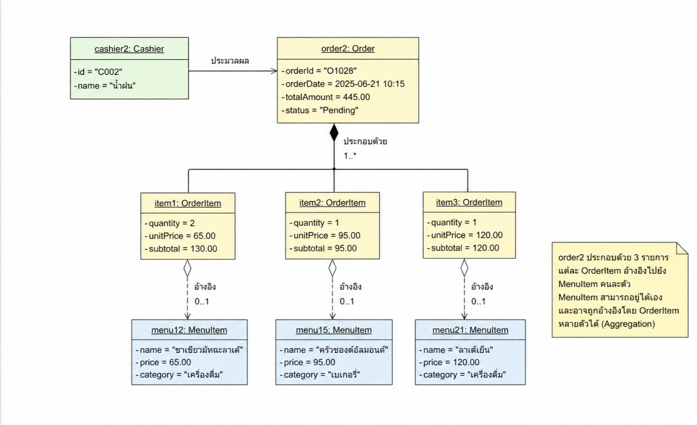

# สัปดาห์ที่ 6: รายงานวัดผล CLO1 (รายบุคคล)

**ชื่องาน:** อธิบายเหตุผลของความสัมพันธ์ระหว่าง Class และตรวจสอบความสอดคล้องระหว่าง Diagram กับโค้ด  
**วิชา:** การออกแบบเชิงวัตถุและสถาปัตยกรรมซอฟต์แวร์ (Object-Oriented Design)

---

## 1. Class Diagram ระหว่าง Order กับ OrderItem และเหตุผลของความสัมพันธ์ (Composition)

### 1.1 Mini Class Diagram



Class Diagram นี้ประกอบด้วย 2 คลาส คือ `Order` และ `OrderItem` โดย `Order` ทำหน้าที่เป็นเจ้าของรายการสินค้า (`OrderItem`) ภายในออเดอร์

`Order` มีข้อมูลสำคัญ ได้แก่

- `orderId : String` — หมายเลขออเดอร์
- `orderDate : Date` — วันที่และเวลาที่สร้างออเดอร์
- `totalAmount : double` — ยอดรวมของออเดอร์
- `status : String` — สถานะของออเดอร์

และมี method สำหรับจัดการออเดอร์ ได้แก่

- `addItem(item: OrderItem) : void`
- `removeItem(index: int) : void`
- `calculateTotal() : double`

ส่วน `OrderItem` ใช้เก็บรายละเอียดของรายการสินค้าแต่ละรายการ ได้แก่

- `quantity : int` — จำนวนสินค้าที่สั่ง
- `unitPrice : double` — ราคาต่อหน่วย
- `subtotal : double` — ราคารวมของรายการนั้น

และมี method `calculateSubtotal() : double`

ความสัมพันธ์ระหว่าง `Order` และ `OrderItem` เป็น **Composition** โดยใช้ข้าวหลามตัดทึบ (◆) อยู่ทางฝั่ง `Order`

**Cardinality**

- `Order` 1 ตัว มี `OrderItem` ได้ตั้งแต่ `1..*` ตัว
- `OrderItem` แต่ละตัวเป็นส่วนหนึ่งของ `Order` ที่เป็นเจ้าของ

### 1.2 เหตุผลที่ความสัมพันธ์ต้องเป็น Composition

ความสัมพันธ์ระหว่าง `Order` กับ `OrderItem` ควรเป็น **Composition** เพราะ `OrderItem` เป็นส่วนประกอบของ `Order` และมีความหมายในบริบทของออเดอร์นั้นโดยตรง

ตัวอย่างเช่น หากมีออเดอร์หนึ่งรายการ เช่น `order2` ภายในออเดอร์จะประกอบด้วย `item1`, `item2` และ `item3` ซึ่งแต่ละตัวแทนรายการสินค้าที่ลูกค้าสั่ง

`OrderItem` ไม่ควรมีอยู่เป็นข้อมูลอิสระโดยไม่มี `Order` เป็นเจ้าของ เพราะเมื่อไม่มีออเดอร์ รายการสินค้านั้นก็ไม่สามารถบอกได้ว่าเป็นส่วนหนึ่งของบิลใด

ดังนั้น เมื่อ `Order` ถูกลบหรือถูกยกเลิก รายการ `OrderItem` ที่เป็นส่วนประกอบของออเดอร์นั้นก็ควรถูกลบตามไปด้วย

### 1.3 ผลกระทบหากออกแบบเป็น Aggregation

ถ้าออกแบบความสัมพันธ์นี้เป็น **Aggregation** แทน Composition จะทำให้ `OrderItem` สามารถดำรงอยู่แยกจาก `Order` ได้ ซึ่งอาจทำให้เกิดข้อมูลกำพร้า (Orphan Data)

ตัวอย่างเช่น หากลบออเดอร์หนึ่งออกจากระบบ แต่ `OrderItem` ของออเดอร์นั้นยังคงอยู่ อาจทำให้ระบบมีรายการสินค้าที่ไม่สามารถระบุได้ว่าเป็นของออเดอร์ใด

ในระบบ POS ของร้านกาแฟ ปัญหานี้อาจส่งผลต่อการคำนวณยอดขาย การตรวจสอบรายการในบิล และรายงานต่าง ๆ เพราะมี `OrderItem` ที่ไม่สัมพันธ์กับ `Order` ที่เป็นเจ้าของอย่างถูกต้อง

ดังนั้นการใช้ Composition จึงเหมาะสมกว่า เพราะช่วยสะท้อนว่า `Order` เป็นเจ้าของ `OrderItem` และควบคุมวงจรชีวิตของรายการเหล่านี้

---

## 2. ความสัมพันธ์ระหว่าง OrderItem กับ MenuItem (Aggregation)

ความสัมพันธ์ระหว่าง `OrderItem` กับ `MenuItem` ควรเป็น **Aggregation** เพราะ `MenuItem` สามารถดำรงอยู่ได้ด้วยตัวเอง ไม่จำเป็นต้องมี `OrderItem` อ้างอิงอยู่ตลอดเวลา

ตัวอย่างเช่น ร้านกาแฟอาจมีเมนู "ชาเขียวมัทฉะลาเต้" อยู่ในระบบ แม้ว่าจะยังไม่มีลูกค้าสั่งเมนูนี้เลยก็ตาม

ใน Object Diagram จะเห็นว่า

- `item1: OrderItem` อ้างอิงไปยัง `menu12: MenuItem`
- `item2: OrderItem` อ้างอิงไปยัง `menu15: MenuItem`
- `item3: OrderItem` อ้างอิงไปยัง `menu21: MenuItem`

โดย `MenuItem` แต่ละตัวสามารถดำรงอยู่ได้โดยไม่ขึ้นกับ `OrderItem`

### 2.1 เหตุผลที่ต้องเป็น Aggregation

`MenuItem` เป็นข้อมูลเมนูของร้าน ซึ่งมีวงจรชีวิตเป็นของตัวเอง เช่น ร้านสามารถเพิ่ม แก้ไข หยุดขาย หรือกลับมาขายเมนูเดิมได้ โดยไม่จำเป็นต้องสร้างหรือลบตาม `OrderItem`

นอกจากนี้ `MenuItem` เดียวกันสามารถถูกอ้างอิงโดย `OrderItem` จากหลายออเดอร์ได้

ตัวอย่างเช่น เมนู "ลาเต้เย็น" สามารถถูกลูกค้าหลายคนสั่งในออเดอร์ที่แตกต่างกัน ดังนั้น `MenuItem` จึงไม่ควรเป็นเจ้าของโดย `OrderItem` เพียงตัวเดียว

### 2.2 ผลกระทบหากออกแบบเป็น Composition

หากออกแบบ `OrderItem` กับ `MenuItem` เป็น Composition จะทำให้เกิดปัญหาเรื่องวงจรชีวิตของข้อมูล

ตัวอย่างเช่น หาก `OrderItem` ถูกลบเพราะลูกค้ายกเลิกรายการสินค้า ระบบอาจเข้าใจว่า `MenuItem` ที่เกี่ยวข้องต้องถูกลบตามไปด้วย ซึ่งไม่ถูกต้อง เพราะเมนูนั้นยังสามารถขายให้ลูกค้าคนอื่นได้

อีกกรณีหนึ่งคือ เมนูบางรายการอาจถูกหยุดขายชั่วคราว แต่ร้านยังต้องเก็บข้อมูลเมนูและประวัติออเดอร์เก่าเอาไว้ หากลบ `MenuItem` ไปพร้อมกับ `OrderItem` จะทำให้ข้อมูลที่เกี่ยวข้องกับออเดอร์เก่าเสียหายหรือไม่สามารถแสดงรายละเอียดเดิมได้

ดังนั้น `MenuItem` จึงควรมีวงจรชีวิตที่เป็นอิสระจาก `OrderItem` และใช้ความสัมพันธ์แบบ Aggregation

### 2.3 การเก็บราคาของสินค้า

`OrderItem` มี `unitPrice` ของตัวเอง เพื่อเก็บราคาของสินค้า ณ เวลาที่ลูกค้าสั่ง

เหตุผลคือราคาของ `MenuItem` อาจเปลี่ยนแปลงในอนาคต แต่ราคาของรายการที่อยู่ในออเดอร์เก่าควรยังคงเป็นราคาเดิม เพื่อให้สามารถตรวจสอบยอดเงินของออเดอร์ย้อนหลังได้อย่างถูกต้อง

---

## 3. การเพิ่ม Method `removeItem(index)` ตามหลัก Encapsulation

### 3.1 Method ที่เพิ่มในคลาส Order

```javascript
removeItem(index) {
    if (index < 0 || index >= this.items.length) {
        return false;
    }

    this.items.splice(index, 1);
    return true;
}
```

Method นี้ใช้สำหรับลบ `OrderItem` ออกจาก `Order` โดยรับ `index` ของรายการที่ต้องการลบ

ก่อนลบจะตรวจสอบก่อนว่า `index` อยู่ในขอบเขตของ `items` หรือไม่

- ถ้า `index` ไม่ถูกต้อง จะคืนค่า `false`
- ถ้า `index` ถูกต้อง จะลบรายการออกจาก `items` และคืนค่า `true`

### 3.2 เหตุผลตามหลัก Encapsulation

Method `removeItem()` ควรอยู่ในคลาส `Order` แทนที่จะให้ Controller เข้าถึง `order.items` แล้วลบข้อมูลโดยตรง

ตัวอย่างการออกแบบที่ไม่เหมาะสมคือ

```javascript
order.items.splice(index, 1);
```

การให้ Controller แก้ไข `items` โดยตรงทำให้ Controller ต้องรู้รายละเอียดภายในของ `Order` และสามารถแก้ไขข้อมูลได้โดยไม่ผ่านกฎหรือการตรวจสอบของคลาส

ในทางตรงกันข้าม การสร้าง `removeItem()` ไว้ใน `Order` ทำให้ `Order` เป็นผู้รับผิดชอบข้อมูลของตัวเอง และสามารถตรวจสอบ `index` ก่อนดำเนินการได้

แนวทางนี้สอดคล้องกับหลัก **Encapsulation** ซึ่งต้องการซ่อนรายละเอียดภายในของ Object และให้ Object เป็นผู้ควบคุมการเปลี่ยนแปลง State ของตัวเอง

นอกจากนี้ หากในอนาคตมีการเปลี่ยนวิธีจัดเก็บรายการสินค้าจาก Array ไปเป็นโครงสร้างข้อมูลชนิดอื่น Controller ก็ไม่จำเป็นต้องแก้ไข เพราะ Controller ยังคงเรียก `removeItem()` ผ่าน interface ของ `Order` เหมือนเดิม

---

## 4. Object Diagram สถานการณ์ใหม่และการสะท้อนกฎ Composition / Aggregation

### 4.1 รายละเอียดสถานการณ์

สถานการณ์ใน Object Diagram เป็นออเดอร์ใหม่ที่แตกต่างจากตัวอย่างเดิม โดยมีแคชเชียร์ `cashier2` กำลังประมวลผลออเดอร์ `order2`

### Cashier

`cashier2 : Cashier`

- `id = "C002"`
- `name = "น้ำฝน"`

Cashier คนนี้ทำหน้าที่ประมวลผล `order2`

### Order

`order2 : Order`

- `orderId = "O1028"`
- `orderDate = 2025-06-21 10:15`
- `totalAmount = 445.00`
- `status = "Pending"`

ออเดอร์นี้ประกอบด้วย `OrderItem` จำนวน 3 รายการ

### OrderItem รายการที่ 1

`item1 : OrderItem`

- `quantity = 2`
- `unitPrice = 65.00`
- `subtotal = 130.00`

อ้างอิงไปยัง `menu12 : MenuItem`

- `name = "ชาเขียวมัทฉะลาเต้"`
- `price = 65.00`
- `category = "เครื่องดื่ม"`

### OrderItem รายการที่ 2

`item2 : OrderItem`

- `quantity = 1`
- `unitPrice = 95.00`
- `subtotal = 95.00`

อ้างอิงไปยัง `menu15 : MenuItem`

- `name = "ครัวซองต์อัลมอนด์"`
- `price = 95.00`
- `category = "เบเกอรี่"`

### OrderItem รายการที่ 3

`item3 : OrderItem`

- `quantity = 1`
- `unitPrice = 120.00`
- `subtotal = 120.00`

อ้างอิงไปยัง `menu21 : MenuItem`

- `name = "ลาเต้เย็น"`
- `price = 120.00`
- `category = "เครื่องดื่ม"`

### 4.2 Object Diagram



Object Diagram แสดงสถานะของ Object จริงในขณะ Runtime โดยไม่ได้แสดงเพียงชื่อ Class เหมือน Class Diagram

ใน Diagram นี้ `order2 : Order` มี `OrderItem` อยู่ 3 ตัว ได้แก่

- `item1 : OrderItem`
- `item2 : OrderItem`
- `item3 : OrderItem`

และแต่ละ `OrderItem` อ้างอิงไปยัง `MenuItem` ที่แตกต่างกัน

### 4.3 การสะท้อนกฎ Composition

ความสัมพันธ์ระหว่าง `order2 : Order` กับ `item1 : OrderItem`, `item2 : OrderItem` และ `item3 : OrderItem` เป็น **Composition**

ซึ่งแสดงด้วยข้าวหลามตัดทึบ (◆) ที่ฝั่ง `order2`

หมายความว่า `Order` เป็นเจ้าของ `OrderItem` เหล่านี้

ดังนั้น หาก `order2` ถูกลบ รายการ `item1`, `item2` และ `item3` ที่เป็นส่วนประกอบของออเดอร์นี้ก็ควรถูกลบตามไปด้วย เพราะรายการเหล่านี้ไม่มีความหมายในระบบหากไม่รู้ว่าเป็นส่วนหนึ่งของ Order ใด

Object Diagram จึงสะท้อนกฎ Composition ได้อย่างชัดเจนว่า `OrderItem` เป็นส่วนหนึ่งของ `Order` และมีวงจรชีวิตขึ้นอยู่กับ `Order`

### 4.4 การสะท้อนกฎ Aggregation

ความสัมพันธ์ระหว่าง `OrderItem` กับ `MenuItem` เป็น **Aggregation**

ใน Diagram แสดงด้วยข้าวหลามตัดโปร่ง (◇) ที่ฝั่ง `OrderItem` และเส้นประที่เชื่อมไปยัง `MenuItem`

ตัวอย่างเช่น

- `item1` อ้างอิง `menu12`
- `item2` อ้างอิง `menu15`
- `item3` อ้างอิง `menu21`

แต่ `MenuItem` แต่ละตัวไม่ได้เป็นส่วนหนึ่งของ `Order` โดยตรง และสามารถดำรงอยู่ได้แม้ `Order` จะถูกลบ

ตัวอย่างเช่น หาก `order2` ถูกยกเลิก `menu12`, `menu15` และ `menu21` ไม่ควรถูกลบออกจากระบบ เพราะเมนูเหล่านี้ยังสามารถถูกใช้กับออเดอร์อื่นในอนาคตได้

ดังนั้น Object Diagram นี้จึงแสดงให้เห็นความแตกต่างของทั้งสองความสัมพันธ์อย่างชัดเจน คือ

- **Composition:** `Order` เป็นเจ้าของ `OrderItem` และ `OrderItem` มีวงจรชีวิตผูกกับ `Order`
- **Aggregation:** `OrderItem` อ้างอิง `MenuItem` แต่ `MenuItem` มีวงจรชีวิตเป็นอิสระและสามารถถูกอ้างอิงจาก `OrderItem` อื่นได้
